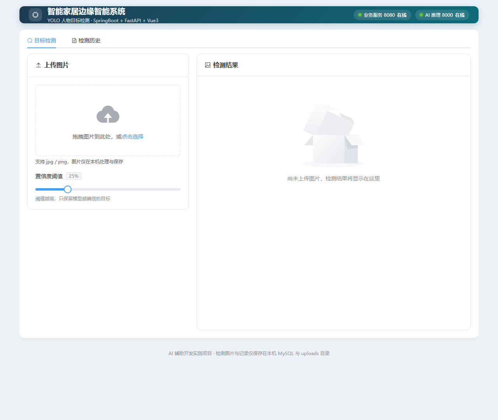
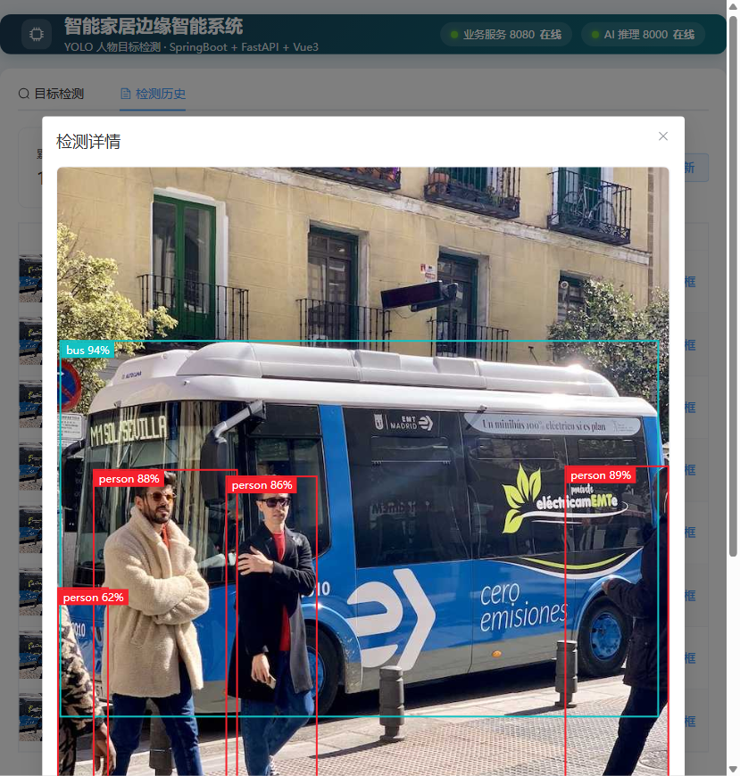
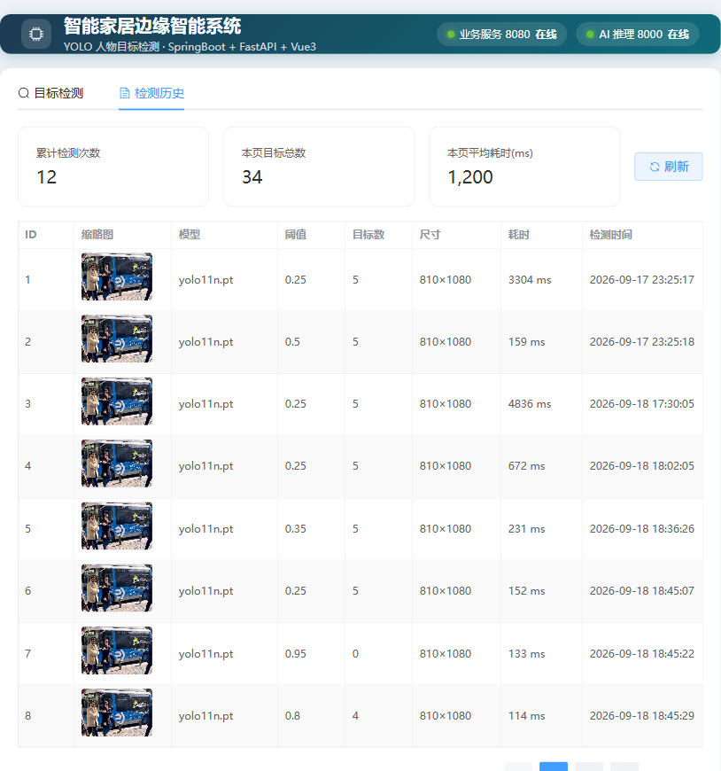

# Smart Home 智能家居边缘智能系统（Web 全栈版）

浏览器可用的「图片上传 → YOLO 目标检测 → 结果可视化与历史留存」AI 全栈系统。
由华清远见实训项目（STM32 + Linux C 网关 + Qt + Python YOLO）Web 化重构而来，采用 **AI 辅助编程（Vibe Coding）** 方式完成：人负责架构设计、接口契约、代码审查、联调排错，AI 负责大量样板代码生成。

## 架构总览

```
┌──────────────┐   HTTP(/api)   ┌────────────────────┐   HTTP(multipart)  ┌─────────────────────┐
│  Vue3 前端    │  ───────────▶  │ SpringBoot 业务层   │  ────────────────▶  │ FastAPI 推理层       │
│  Vite+Element │  ◀───────────  │ 转发/落库/分页/文档  │  ◀────────────────  │ YOLO11 目标检测      │
│  端口 5173    │   JSON 结果    │ 端口 8080           │    结构化坐标 JSON  │ 端口 8000            │
└──────────────┘                └─────────┬──────────┘                     └─────────────────────┘
                                          │ MyBatis-Plus
                                          ▼
                                  ┌────────────────────┐
                                  │  MySQL 库 smarthome │
                                  │  表 detect_record   │
                                  └────────────────────┘
```

| 层 | 目录 | 技术栈 | 端口 |
|---|---|---|---|
| 展示层 | `web/` | Vue3 + Vite + Element Plus + axios | 5173 |
| 业务服务层 | `server/` | SpringBoot 3.3 + Java 17 + MyBatis-Plus + MySQL | 8080 |
| AI 推理层 | `ai-platform/` | Python 3.11 + FastAPI + YOLO11(ultralytics 8.3.86) | 8000 |
| 采集接入层 | 原实训资产 | STM32 + Linux C 网关 + Modbus TCP，仅作为业务背景保留 | — |

**数据流**：前端拖拽上传图片 → SpringBoot 接收并转发给 FastAPI → YOLO 推理返回目标坐标 JSON → SpringBoot 把原图存盘、结果入库 → 前端按归一化坐标在图上叠加检测框。

## 界面预览

| 检测页（上传 + 阈值调节 + 实时服务状态） | 检测结果（画框 + 目标明细高亮） |
|---|---|
|  |  |
| **检测历史（统计卡片 + 分页表格 + 缩略图）** | |
|  | |

## 目录结构

```
Smart Home/
├── ai-platform/          # FastAPI 推理服务
│   ├── app/main.py       # 路由：/detect、/health
│   ├── app/detector.py   # YOLO 加载与推理（模型单例缓存）
│   ├── models/           # 权重 yolo11n.pt
│   ├── train/            # 数据集与训练脚本（82 帧两类目标）
│   └── test_images/
├── server/               # SpringBoot 业务服务
│   ├── src/main/java/com/smarthome/
│   │   ├── controller/   # DetectController（上传/历史/详情/健康）
│   │   ├── service/      # Detect/Record/FileStorage 业务逻辑
│   │   ├── client/       # AiDetectClient（RestClient 调 FastAPI）
│   │   ├── entity/mapper/vo/common/config
│   └── src/main/resources/
│       ├── application.yml        # 公共配置（不含密码）
│       ├── application-local.yml  # 本地密码（gitignore，不提交）
│       └── db/schema.sql          # 建库建表脚本
├── web/                  # Vue3 前端
│   └── src/{api,components}/
└── docs/                 # 交接手册、训练结果、联调截图
```

## 快速开始

需要三个终端，按 **AI 服务 → 业务服务 → 前端** 的顺序启动。

### 1. AI 推理服务（FastAPI，端口 8000）

```powershell
cd "D:\My project\Smart Home\ai-platform"
& "D:\yolo_project\Miniconda_install\envs\hbkjyolo\python.exe" -m uvicorn app.main:app --port 8000
```

- 接口文档：http://127.0.0.1:8000/docs ；健康检查：http://127.0.0.1:8000/health
- 全新环境依赖安装见 `ai-platform/README.md`

### 2. 数据库（MySQL，端口 3306）

- 确保 MySQL 服务运行，账号 `root`，执行 `server/src/main/resources/db/schema.sql` 建库建表
- 在 `server/src/main/resources/application-local.yml` 中配置本机数据库密码（该文件不提交 Git）

### 3. 业务服务（SpringBoot，端口 8080）

```powershell
cd "D:\My project\Smart Home\server"
mvn spring-boot:run
```

- 健康检查（含下游 AI 服务探活）：http://127.0.0.1:8080/api/health
- 接口文档：http://127.0.0.1:8080/swagger-ui/index.html

### 4. 前端（Vite，端口 5173）

```powershell
cd "D:\My project\Smart Home\web"
npm install      # 首次拉取依赖
npm run dev      # 启动后浏览器访问 http://localhost:5173
```

前端只访问 5173，`/api` 与 `/uploads` 由 Vite dev proxy 转发到 8080，避免跨域。

## 主要接口

| 方法 | 路径 | 作用 |
|---|---|---|
| POST | `:8000/detect` | FastAPI：multipart 上传图片，返回目标坐标 JSON |
| GET | `:8000/health` | AI 服务健康检查 |
| POST | `:8080/api/detect` | 业务层上传入口，转发推理、存图、入库 |
| GET | `:8080/api/records?pageNum&pageSize` | 检测历史分页 |
| GET | `:8080/api/records/{id}` | 检测详情（含完整结果 JSON） |
| GET | `:8080/api/health` | 业务层 + 下游 AI 联合健康检查 |

## 关键技术点

- **异构技术栈 HTTP 解耦**：Java 业务层与 Python 推理层各自独立部署、独立选型，用 REST + multipart 通信。
- **模型进程内单例缓存**：YOLO 权重只在首次请求加载（约 3 秒），之后复用内存模型，单次推理降到百毫秒级。
- **检测框坐标归一化**：模型返回基于原图分辨率的像素坐标，前端统一换算成百分比定位，图片任意缩放框不错位。
- **统一响应与全局异常**：后端 `{code,msg,data}` 规范，axios 响应拦截器统一解包与报错。
- **工程规范**：多环境配置（密码走 local 配置不入库）、Git 提交规范、Vite 代理跨域、springdoc 自动接口文档。

## 文档

- 完整背景、接口契约、环境搭建、踩坑与面试预案：[`docs/PROJECT_CONTEXT.md`](docs/PROJECT_CONTEXT.md)
- 简历项目段定稿：[`docs/简历-项目描述.md`](docs/简历-项目描述.md)
- 原实训训练评估结果：`docs/train-result/`
