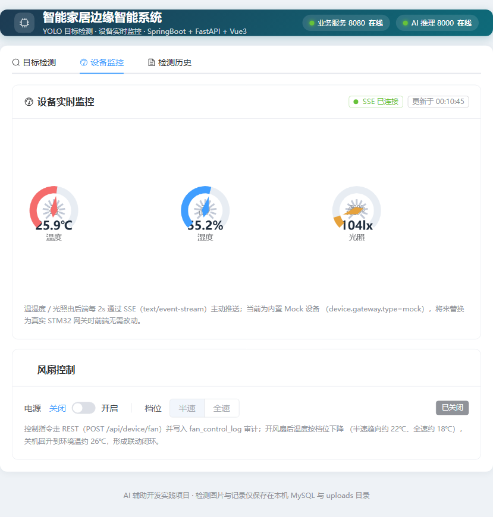
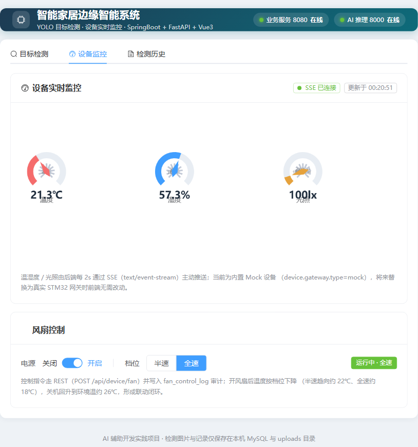

# Smart Home 智能家居边缘智能系统（Web 全栈版）

浏览器可用的 AIoT 全栈系统，包含两条业务线：

1. **AI 视觉检测线**：图片上传 → YOLO 目标检测 → 结果可视化与历史留存；
2. **设备实时监控线（阶段6a）**：温湿度 / 光照实时遥测（SSE 推送）+ 风扇开关档位控制（REST）+ 「开风扇 → 温度下降」联动闭环（当前用内置 Mock 设备，预留真实 STM32 网关接入）。

由华清远见毕业实习项目（STM32 + Linux C 网关 + Qt + Python YOLO）Web 化重构而来，采用 **AI 辅助编程（Vibe Coding）** 方式完成：人负责架构设计、接口契约、代码审查、联调排错，AI 负责大量样板代码生成。

## 架构总览

```
                          ① REST 上行命令(/api/device/fan)
                 ┌──────────────────────────────────────┐
                 │                                        │
                 ▼                                        │ ② SSE 下行遥测(/api/device/stream, 每2s)
┌──────────────┐  HTTP(/api) + SSE  ┌────────────────────┐   multipart/JSON   ┌─────────────────────┐
│  Vue3 前端    │  ◀──────────────▶  │ SpringBoot 业务层   │  ────────────────▶  │ FastAPI 推理层       │
│ Vite+Element │  仪表盘/开关/上传   │ 转发/落库/分页/SSE   │  ◀────────────────  │ YOLO11 目标检测      │
│ ECharts 5173 │                    │ 端口 8080           │   结构化坐标 JSON   │ 端口 8000            │
└──────────────┘                    └─────────┬──────────┘                     └─────────────────────┘
                                              │ MyBatis-Plus
                                              ▼
                    ┌──────────────────────────┴──────────────────────────┐
                    │  MySQL 库 smarthome                                   │
                    │  detect_record（检测记录）/ device（设备）/           │
                    │  fan_control_log（风扇控制日志）                      │
                    └──────────────────────────────────────────────────────┘
                                              ▲
                                              │ snapshot()/controlFan()
                                    ┌─────────┴─────────┐
                                    │ DeviceGateway 设备网关（适配器）  │
                                    │ · MockDeviceGateway（当前，内存物理模型）│
                                    │ · TcpModbusGateway（预留，接 STM32）  │
                                    └───────────────────────────┘
```

| 层 | 目录 | 技术栈 | 端口 |
|---|---|---|---|
| 展示层 | `web/` | Vue3 + Vite + Element Plus + ECharts + axios | 5173 |
| 业务服务层 | `server/` | SpringBoot 3.3 + Java 17 + MyBatis-Plus + MySQL + SSE | 8080 |
| AI 推理层 | `ai-platform/` | Python 3.11 + FastAPI + YOLO11(ultralytics 8.3.86) | 8000 |
| 设备接入层 | `server/.../device/` | `DeviceGateway` 适配器 + 内置 Mock 设备（预留 TCP/Modbus 接 STM32） | — |

**两条数据流**：

- **检测线**：前端拖拽上传图片 → SpringBoot 接收并转发给 FastAPI → YOLO 推理返回目标坐标 JSON → SpringBoot 存图、结果入库 → 前端按归一化坐标在图上叠加检测框。
- **设备线**：后端定时任务每 2s 推进 Mock 物理模型（温湿度/光照/风扇状态），通过 **SSE** 主动推给前端仪表盘；前端操作风扇走 **REST** 下发，后端校验档位、写入 `fan_control_log`、更新设备状态，温度按档位（半速趋向 22℃ / 全速趋向 18℃ / 关机回升 26℃）形成闭环。

## 界面预览

| 检测页（上传 + 阈值调节 + 实时服务状态） | 检测结果（画框 + 目标明细高亮） |
|---|---|
|  |  |
| **检测历史（统计卡片 + 分页表格 + 缩略图）** | |
|  | |
| **设备实时监控（SSE 三仪表盘：温度/湿度/光照）** | **风扇控制（REST 开关档位 + 全速降温闭环）** |
|  |  |

## 目录结构

```
Smart Home/
├── ai-platform/          # FastAPI 推理服务
│   ├── app/main.py       # 路由：/detect、/health
│   ├── app/detector.py   # YOLO 加载与推理（模型单例缓存）
│   ├── models/           # 权重 yolo11n.pt
│   ├── train/            # 数据集与训练脚本（82 帧两类目标）
│   └── test_images/
├── server/               # SpringBoot 业务服务
│   ├── src/main/java/com/smarthome/
│   │   ├── controller/   # DetectController / DeviceController（status/fan/stream）
│   │   ├── service/      # Detect/Record/FileStorage / DeviceService
│   │   ├── device/       # DeviceGateway 接口 + MockDeviceGateway + DeviceSseManager
│   │   ├── client/       # AiDetectClient（RestClient 调 FastAPI）
│   │   ├── entity/mapper # DetectRecord / Device / FanControlLog
│   │   ├── dto/vo        # FanControlRequest（@Valid）/ DeviceSnapshot 等
│   │   ├── config/       # RestClient/Web/MybatisPlus/Scheduling（@Scheduled 线程池）
│   │   └── common/       # ApiResponse / BusinessException / GlobalExceptionHandler
│   └── src/main/resources/
│       ├── application.yml        # 公共配置（不含密码）
│       ├── application-local.yml  # 本地密码（gitignore，不提交）
│       └── db/schema.sql          # 建库建表脚本（3 张表）
├── web/                  # Vue3 前端
│   └── src/
│       ├── api/          # request.js（axios 拦截器）/ detect.js / device.js
│       └── components/   # DetectPanel / ResultImage / RecordTable / DevicePanel（ECharts+SSE）
└── docs/                 # 交接手册、训练结果、联调截图
```

## 快速开始

需要三个终端，按 **AI 服务 → 业务服务 → 前端** 的顺序启动。设备监控线不依赖 AI 服务（8000 未启动时仅顶部「AI 推理」徽章显示离线，设备 Tab 正常工作）。

### 1. AI 推理服务（FastAPI，端口 8000）

```powershell
cd "D:\My project\Smart Home\ai-platform"
& "D:\yolo_project\Miniconda_install\envs\hbkjyolo\python.exe" -m uvicorn app.main:app --port 8000
```

- 接口文档：http://127.0.0.1:8000/docs ；健康检查：http://127.0.0.1:8000/health
- 全新环境依赖安装见 `ai-platform/README.md`

### 2. 数据库（MySQL，端口 3306）

- 确保 MySQL 服务运行，账号 `root`，执行 `server/src/main/resources/db/schema.sql` 建库建表（detect_record / device / fan_control_log，并预置一台客厅设备）
- 在 `server/src/main/resources/application-local.yml` 中配置本机数据库密码（该文件不提交 Git）

### 3. 业务服务（SpringBoot，端口 8080）

```powershell
cd "D:\My project\Smart Home\server"
mvn spring-boot:run
```

- 健康检查（含下游 AI 服务探活）：http://127.0.0.1:8080/api/health
- 接口文档：http://127.0.0.1:8080/swagger-ui/index.html

### 4. 前端（Vite，端口 5173）

```powershell
cd "D:\My project\Smart Home\web"
npm install      # 首次拉取依赖
npm run dev      # 启动后浏览器访问 http://localhost:5173
```

前端只访问 5173，`/api`（含 SSE）与 `/uploads` 由 Vite dev proxy 转发到 8080，避免跨域。

## 主要接口

| 方法 | 路径 | 作用 |
|---|---|---|
| POST | `:8000/detect` | FastAPI：multipart 上传图片，返回目标坐标 JSON |
| GET | `:8000/health` | AI 服务健康检查 |
| POST | `:8080/api/detect` | 业务层上传入口，转发推理、存图、入库 |
| GET | `:8080/api/records?pageNum&pageSize` | 检测历史分页 |
| GET | `:8080/api/records/{id}` | 检测详情（含完整结果 JSON） |
| GET | `:8080/api/device/status` | 设备当前遥测快照（页面首屏立即加载） |
| POST | `:8080/api/device/fan` | 风扇控制，body `{power:true/false, speed:0/1/2}`，写控制日志 |
| GET | `:8080/api/device/stream` | **SSE** 遥测流（text/event-stream），服务器每 2s 推一帧 |
| GET | `:8080/api/health` | 业务层 + 下游 AI 联合健康检查 |

风扇档位约定：`speed` 0=关 / 1=半速 / 2=全速；开机时只允许 1 或 2，参数非法返回 HTTP 400。

## 关键技术点

- **异构技术栈 HTTP 解耦**：Java 业务层与 Python 推理层各自独立部署、独立选型，用 REST + multipart 通信。
- **SSE 服务端推送（下行）与 REST 命令（上行）分离**：遥测是「服务器→浏览器」的高频单向数据，用 SSE（基于普通 HTTP、原生 EventSource 自带断线重连、比 WebSocket 轻）；风扇控制是一次性「请求-响应」命令，走 REST（天然状态码、可重试、Swagger 可测、易鉴权审计），不强行用双向 WebSocket。
- **定时调度与并发安全**：`@EnableScheduling` + 独立 `ThreadPoolTaskScheduler`（2 线程）跑物理模型推进与 SSE 广播；设备状态用 `AtomicReference` 承载（调度线程写 / Tomcat 请求线程读），SSE 连接集合用 `CopyOnWriteArrayList`（读多写少）。
- **适配器 + 条件装配预留硬件接入**：业务层只依赖 `DeviceGateway` 接口，当前 `MockDeviceGateway` 用内存物理模型模拟设备，`@ConditionalOnProperty(device.gateway.type)` 控制；将来加一个 TCP/Modbus 实现即可接真实 STM32，业务/前端/数据库零改动。
- **参数校验与统一异常**：`@Valid` + 全局异常处理把校验失败统一返回 HTTP 400 + 中文提示；全后端 `{code,msg,data}` 规范，axios 拦截器统一解包。
- **模型进程内单例缓存**：YOLO 权重只在首次请求加载（约 3 秒），之后复用内存模型，单次推理降到百毫秒级。
- **检测框坐标归一化**：模型返回基于原图分辨率的像素坐标，前端统一换算成百分比定位，图片任意缩放框不错位。
- **工程规范**：多环境配置（密码走 local 配置不入库）、Git 提交规范、Vite 代理跨域、springdoc 自动接口文档。

## 文档

- 完整背景、接口契约、环境搭建、踩坑：[`docs/PROJECT_CONTEXT.md`](docs/PROJECT_CONTEXT.md)
- 原项目训练评估结果：`docs/train-result/`
